How to add a new resource in iotdm
============

[Note] Here we only discuss how to add a new <resource> without affecting the Yang model. Some complicated <resource> such as "AccessControlPolicy" may need to update the yang model.

## 1. Overall Procedure

Let's take the example of how to support a new <Node> resource in the iotdm:

* Read TS 0001 about the node resource part.

In table 9.6.1.1 we find

ResourceType | short description | child resourceType | parent resourceType
----- | --- | --- | ---- |
node	|  Represents specific Node information |  mgmtObj,subscription | CSEBase, remoteCSE

then we have a basic understanding where this <Node> resource might be stored in our iotdm. According to the above message, this <Node> resource is similar to <Container> resource. [This part of information may not be 100% up-to-date in the TS]

* look at the XSD file or the generated JAVA file with such XSD.
[https://github.com/wucangji/iotdm-client-master/tree/master/src/main/java/org/opendaylight/iotdm/primitive]()

For example, if we want to create a new "Node" resource, we can find the file "Nod.java", then we can have a basic understanding of its attribuetes and child resoures. We will use the short name for its attributes.

* add a new resource java class under *"onem2m/onem2m-core/src/main/java/org/opendaylight/iotdm/onem2m/core/resource"*, similar to other java classes under the same foler.

* Look at the TS 00001 to see the detail information of this resource. In the <Node> example, see 9.6.18. According to Figure 9.6.18-2, we know that this <Node> resource contains some unique attributes that only belong to itself such as "nodeID", such attributes will show in the file "ResourceNode" we created.

* Modfy other affected java file: *ResourceContent.java, Onem2m.java, Onem2mStat.java*

## 2.Procedure Sequence

* Processor procedure sequence:

	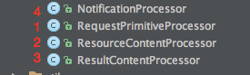
	
	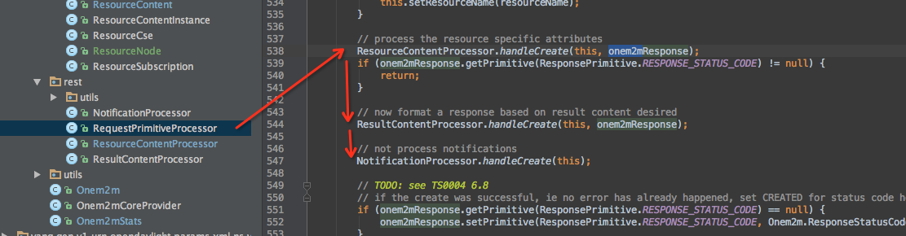

* Inside the reource Sequence:

	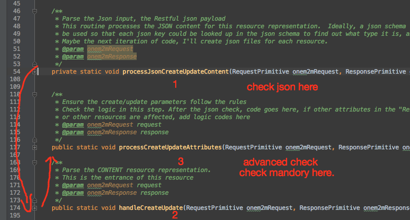

## 3.Implementaion
Take the example of <ResourceNode>:

1. Create a java class called ResourceNode under *"onem2m/onem2m-core/src/main/java/org/opendaylight/iotdm/onem2m/core/resource"*

	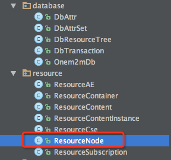

2. Add a new Resourcetype Integer and ResourceType String (check TS0004 6.3.3.2.1, 8.2.4-1 )in "Onem2m.ResourceTypeString"
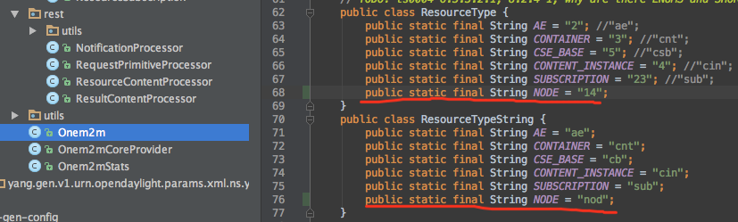
	
	Add new TypetoString in the same file for the new resource.
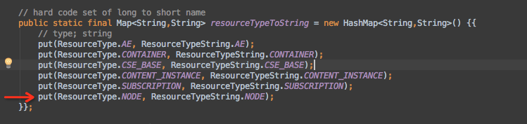

3. <s> Add support in the "ResourceContent.java" 
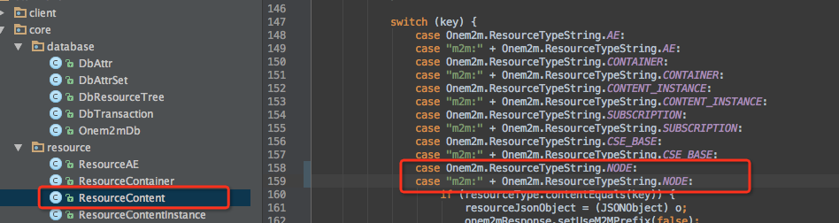
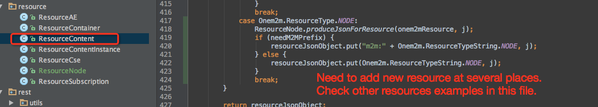
There are several other places need to be modified in this file.
Need to consider both json input and json output support.
</s>    
No need to do the above part any more

	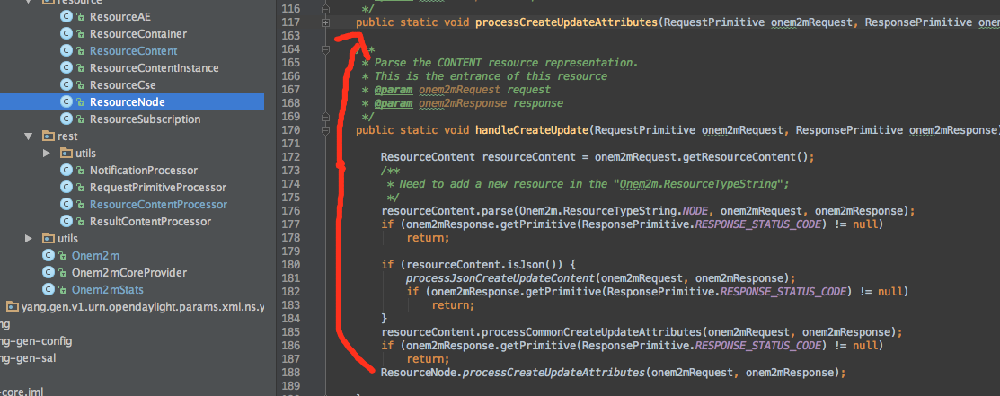
	
4. Update Attribute's rules:
		Only when the attribute is marked as "RW", this attribtue can be updated.
	
	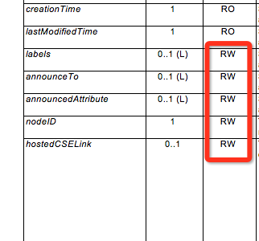
	
	**More detail information are in the example file:
"ResourceNode.java"**

	* "parse" method is used for "checking" the validity, while "process" method is used for "processing" and store information. "parse" only store information for Container's "creator" attribute. 

	* <Mandatory> attributes are checked in the "process" part.

	* `resourceContent.jsonCreateKeys.add(key);` this line is import in the parse step, it is used to respond assigned by system attributes only in the response.
	 
	* "Onem2mDb.java" translate injson payload(payload of create) to json resource then store the whole json resource(what retrieve will return) in the data tree. During this process, if attribute is set to null when <Update>, it will be removed.

5. Add statistics information for this new resource. This stats is used for some analysis in the future.
	
	Modify both "Onem2mStats.java" and "ResourceContentProcessor.java" file:
	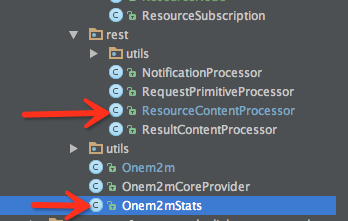
	
	There are 4 places in "ResourceContentProcessor.java" needs to be modified:
	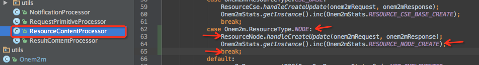
	
	The **Delete** and **Retrieve** method in this file are used for statistic use only.  

6. modify the resourceType in the template's "handleCreateUpdate" method, there are 2 places needs to be replaced.

6. Read Chapter 10 about the detail of CRUD operations for this resource.
7. Add the **logic** part related with this new Resource. In the <Node> example, the related resource is <CSEBase> and <RemoteCSE> etc, we may need to modify the "CRUD" functions of affected resources inside these resources' java file. Might need to modify "Onem2mDb.java".

## 4.Example

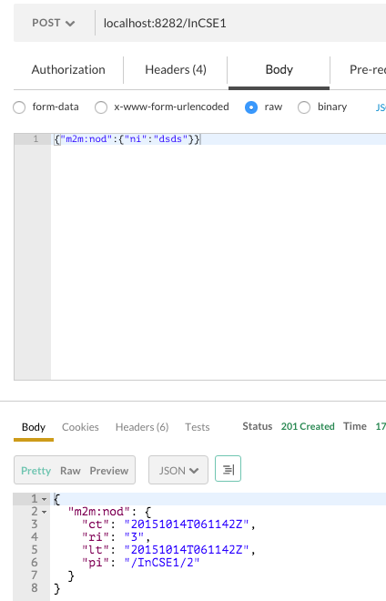